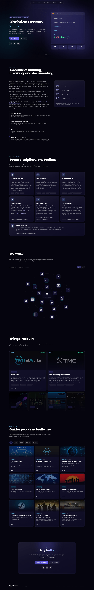

My portfolio [website](https://cdeacon.net) that utilizes [Astro](https://astro.build/), [React](https://react.dev/), and [Tailwind CSS](https://tailwindcss.com/).



## Running
Here are commands you can use to run the web server through Astro (for developer use).

```bash
# Clone repository.
git clone https://github.com/gamemann/portfolio

# Change directory.
cd portfolio

# Install packages.
npm install

# Run Astro's dev server available on port 4321 by default.
# NOTE - You can pass --host <address> to listen on specific IP addresses (or all with 0.0.0.0).
npx astro dev
```

Astro 7 requires **Node.js 22.12 or newer**.

If you want to run this application in production, I recommend looking into [Docker](https://docs.astro.build/en/recipes/docker/).

## Structure
Content lives in `src/data/` so copy changes don't require touching markup.

| File | Contents |
| --- | --- |
| `src/data/site.ts` | Name, tagline, nav items, stats, quick facts, timeline |
| `src/data/skills.ts` | The "What I do" discipline cards |
| `src/data/stack.ts` | Technologies, their group, and proficiency (1–10) |
| `src/data/projects.ts` | Projects, including which are featured and which are still maintained |
| `src/data/guides.ts` | Guides and their filter categories |

Everything else:

- `src/styles/global.css` — the design tokens (Tailwind 4 `@theme`), base styles, and the custom utilities (`surface`, `glow-border`, `text-gradient`, the scroll-reveal system, the CSS typewriter).
- `src/components/ui/` — `Section`, `Badge`, and `Button` primitives shared by every section.
- `src/components/react/` — the only client-side islands: the navigation, the stack orbit, the role typewriter, and the email reveal.

Tailwind is configured CSS-first through `@theme` in `src/styles/global.css`; there is no `tailwind.config.mjs`.

### Proficiency levels
`expLevel` in `src/data/stack.ts` is a 1–10 value that maps to the three labels shown on the site:

| Level | Label |
| --- | --- |
| 8–10 | Very Experienced |
| 4–7 | Experienced |
| 1–3 | Familiar |

It also drives the orbit: the highest-rated technologies fill the innermost ring first.

## Configuration
There are a handful of environmental variables you can configure inside of the `.env` file located in the root of this repository (rename or copy `.env.example` to `.env` if you haven't already). All of them are optional — every feature they gate stays off when the variable is unset.

### `PUBLIC_GOOGLE_ANALYTICS_ID`
If you want Google Analytics support, you will need to set this variable to your property's ID.

### `PUBLIC_EMAIL_ENCODE`
If you want to use your own email address in the contact section, set this variable to the Base64-encoded value of it. You can generate an encoded value with the below command on most Linux systems.

```bash
echo -n '<emailaddress>' | base64
```

For spam protection, instead of storing the email address inside of the HTML code returned by the server, we decode the value inside of the client-side JavaScript code after the user clicks the **Email me** button, which then hands the decoded address to their mail client via `mailto:` and leaves it on screen to copy. Most spam bots don't run JavaScript, so this filters out the majority of them.

If this variable is unset, the encoded address in `src/data/site.ts` is used instead.

While I'm sure there are more secure solutions available such as advanced CAPTCHAs, etc. I just wanted a quick and easy way to eliminate a majority of spam bots.

If I do end up still getting spam through my email, I will most likely look into implementing a third-party library.

### `PUBLIC_UMAMI_WEBSITE_ID`
If you want [Umami](https://umami.is/) analytics support, set this to the website ID (a UUID) from your Umami dashboard. Leaving it empty keeps the tracker off the page entirely.

### `PUBLIC_UMAMI_HOST`
The base URL of the Umami instance serving the tracker, without a trailing slash — for example `https://analytics.example.com`. When unset, this defaults to Umami Cloud (`https://cloud.umami.is`), so you only need to set it if you self-host.

### `PUBLIC_UMAMI_REPLAY`
Set this to `true` to also load Umami's session replay recorder (`recorder.js`) alongside the tracker. This only has an effect when `PUBLIC_UMAMI_WEBSITE_ID` is set.

Replay is opt-in on both ends: as well as setting this variable, you have to enable it for the website under **Replays & Heatmaps** in your Umami dashboard. Sample rate, mask level, max duration, and the block selector are all configured there rather than on the script tag. Only sessions that start after you enable it get recorded.

## Accessibility & motion
Every animation on the page is gated behind `prefers-reduced-motion`, and the scroll-reveal effects fall back to fully visible content when JavaScript is unavailable. The headline is real text in the HTML — the typewriter effect is pure CSS on top of it — so crawlers and screen readers get the whole thing.